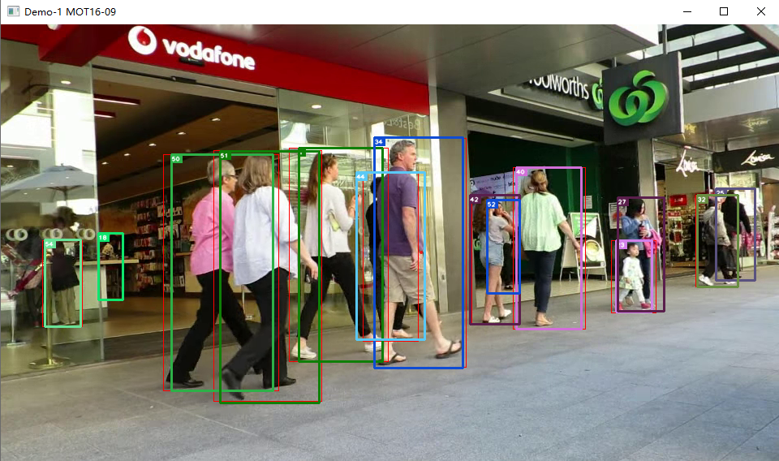
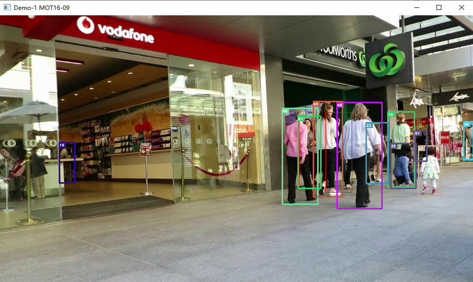

# Yolov5 StrongSORT Demo

## Introduction

**Reproduce the Strong Sort algorithm**

Simple implementation of the Strong Sort algorithm so that it can run private video samples. The detector uses Yolov5 instead of the official detector Faster-RCNN.   

>**[StrongSORT: Make DeepSORT Great Again](https://arxiv.org/abs/2202.13514)**
>
>*Official github address*: https://github.com/dyhBUPT/StrongSORT


## Before you run

1. Download Re-ID model weights from the following web site. The model is trained from [light-reid](https://github.com/wangguanan/light-reid) and obtained by distillation of the light model.  

   - [百度云](https://pan.baidu.com/s/1CaTl8v7JT50KjgtJ3EGK9w?pwd=jasz)  
   - [Google Driver](https://drive.google.com/file/d/1xqRN5WfBTb8M07ej8UVjpyhzJpsmmGZc/view?usp=sharing)

2. Download detector [yolov5]() and download yolo wights from [here](https://github.com/ultralytics/yolov5/releases).
   

3. Set the parameters for Strong Sort in the file [`opt.py`](opts.py)

4. Set the Re-ID model, yolov5 detectors and their weights, etc. paths in the [`config`](configs/config.yaml) file.  

5. Put the test video into `others/input`

## My Environment

- python 3.8
- pytorch 1.8.2 + cu111
- torchvision 0.9.2+cu111
- cuda 10.2
- numpy
- opencv
- scipy

## Tracking

- **DeepSORT**

  ```shell
  python strong_sort.py
  ```

- **StrongSORT**

  ```shell
  python strong_sort.py --NSA --EMA --MC --woC
  ```

## Results

**DeepSORT**



**StrongSORT**


## Note

AFLink and GSI are offline algorithms and cannot be applied in video. 


## Acknowledgement

A large part of the codes and results are borrowed from [DeepSORT](https://github.com/nwojke/deep_sort), [YOLOv5](https://github.com/ultralytics/yolov5), [light-reid](https://github.com/wangguanan/light-reid) and [StrongSort](https://github.com/dyhBUPT/StrongSORT). Thanks for their excellent work!